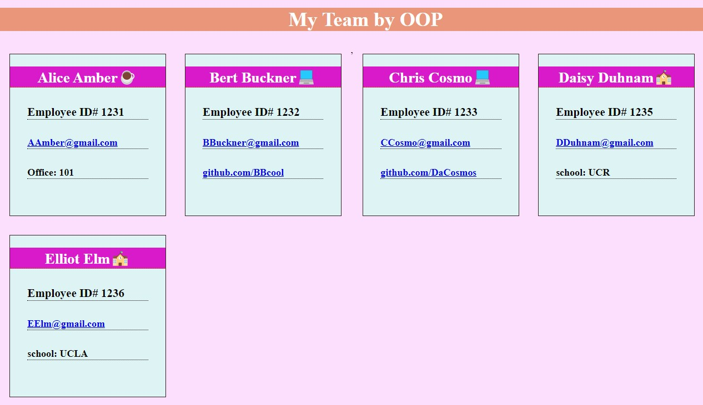

# MyTeamOOP

  

  ## Description
  With this application, you can auto generate a html page of your team members.  By answering questions about your team once prompted in the terminal, it will create a nice neat index.html file with the data user input.

  ## Table of Contents
  - [Description](#description)
  - [Installation](#installation)
  - [Usage](#usage)
  - [License](#license)
  - [Contribution](#contribution)
  - [Test](#test)
  - [questions](#questions)
  - [Github](#github)
  - [Email](#email)
  
  ## Installation
  Clone git repository, type in terminal "npm i" to install node-modules

  ## Usage
  After installation in terminal type "node app.js" to begin, answer the questions with information regarding your TEAM.

  ## License
    This program is licensed by MIT.

  ## Contribution
  none

  ## Test
  
  ## Questions
  Feel free to reach out GitHub or email if you have any questions
  
  ## GitHub URL
  Github: https://github.com/SalvadorBanuelos424
  
  ## Email
  Sbanuelos1234@gmail.com
  
  Made with ❤️ by Salvador Banuelos
### © 2022 Simple_README_generator, Inc.